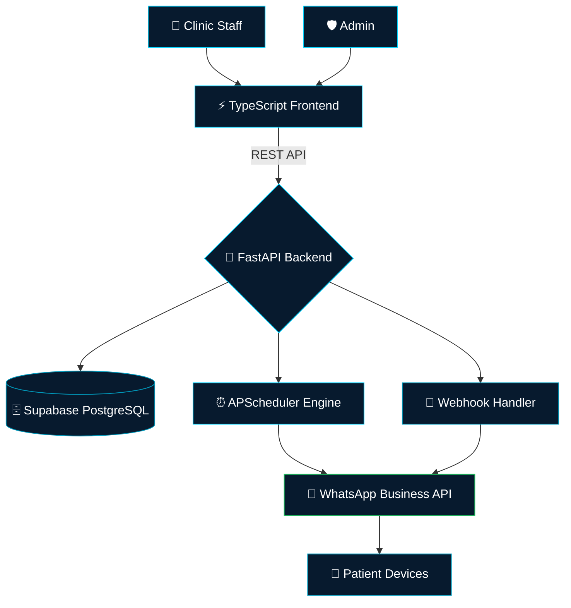

<div align="center">


<br/>

<p align="center">
  
</p>

<br/>

<p align="center">
  
  &nbsp;
  
  &nbsp;
  
  &nbsp;
  
</p>

<p align="center">
  
  
  
  
  
  
</p>

</div>

---

## What is CLINIQ?

CLINIQ is not just an appointment tool. It is a **fully automated reminder intelligence layer for healthcare clinics**.

Traditional clinics lose patients to no-shows because follow-up is manual, inconsistent, and forgotten. CLINIQ eliminates that — automatically scheduling and firing WhatsApp reminders at the right time, for the right patient, from the right clinic — with zero human intervention.

Built on a production-grade FastAPI backend with a scheduler engine, role-based API access, and real-time Supabase persistence — deployed and ready on **Render**.

```
Clinic Staff / Admin
       │
       ▼
 TypeScript Frontend  ──▶  FastAPI REST API  ──▶  Supabase (PostgreSQL)
                                  │
                                  ▼
                        APScheduler Engine
                                  │
                                  ▼
                      WhatsApp Business API
                      └── Automated Reminders → Patients
```

---

## Core Features

<table>
<tr>
<td width="50%">

### 🏥 Multi-Clinic Architecture
- Each clinic operates in full **isolation**
- Clinic-scoped patients, appointments & reminders
- Role-based auth — clinic staff can't cross boundaries
- Secure JWT authentication via `/api/v1/auth`

</td>
<td width="50%">

### 💬 WhatsApp Reminder Engine
- Automated WhatsApp messages via **webhook integration**
- Reminders fire based on appointment schedules
- Configurable timing — same-day, day-before, custom intervals
- Webhook handler for delivery status & inbound replies

</td>
</tr>
<tr>
<td width="50%">

### ⏰ Intelligent Scheduler
- Background `APScheduler` runs independently of request cycles
- Graceful startup & shutdown via FastAPI `lifespan`
- Missed-reminder recovery logic
- Non-blocking async job execution

</td>
<td width="50%">

### 🛡️ Production-Grade Security
- Rate limiting via `SlowAPI` — DDoS & abuse protection
- `SecurityHeadersMiddleware` on every response
- `RequestIDMiddleware` for full request traceability
- CORS configured per environment

</td>
</tr>
</table>

<table>
<tr>
<td width="100%">

### 📊 Health & Observability
- `/health` — lightweight liveness probe for uptime monitors
- `/health/detailed` — deep DB connectivity check via Supabase
- Structured application logging via custom `setup_logging`
- `RequestID` propagated through all logs for trace correlation

</td>
</tr>
</table>

---

## System Architecture



---

## API Modules

| Module | Prefix | Capabilities |
|--------|--------|-------------|
| 🔐 **Auth** | `/api/v1/auth` | Login, token issuance, session management |
| 🏥 **Clinics** | `/api/v1/clinics` | Register & manage clinic profiles |
| 🧑‍⚕️ **Patients** | `/api/v1/patients` | Patient records, contact info |
| 📅 **Appointments** | `/api/v1/appointments` | Schedule, update, cancel appointments |
| 🔗 **Webhooks** | `/api/v1/webhooks` | WhatsApp delivery & reply callbacks |

---

## Tech Stack

| Layer | Technology | Purpose |
|-------|-----------|---------|
| **Backend** | Python 3.11+ · FastAPI | REST API, async request handling |
| **Scheduler** | APScheduler | Background reminder job execution |
| **Database** | Supabase (PostgreSQL) | Persistent storage, real-time queries |
| **Messaging** | WhatsApp Business API | Patient reminder delivery |
| **Frontend** | TypeScript | Clinic management dashboard |
| **Auth** | JWT · FastAPI Security | Role-based access control |
| **Rate Limiting** | SlowAPI | API abuse prevention |
| **Deployment** | Render | Cloud hosting via `render.yaml` |

---

## Project Structure

```
Monitering_System/
│
├── main.py                        # FastAPI app entry point & middleware setup
├── requirements.txt               # Python dependencies
├── schema.sql                     # Supabase database schema
├── render.yaml                    # Render deployment configuration
├── .env.example                   # Environment variable template
│
├── 📁 app/                        # Core application package
│   ├── 📁 api/
│   │   └── routes/                # Route handlers
│   │       ├── auth.py            # Authentication endpoints
│   │       ├── clinics.py         # Clinic management
│   │       ├── patients.py        # Patient records
│   │       ├── appointments.py    # Appointment CRUD
│   │       └── webhooks.py        # WhatsApp webhook receiver
│   ├── 📁 core/
│   │   ├── config.py              # Settings & environment config
│   │   └── logging.py             # Structured logging setup
│   ├── 📁 db/
│   │   └── supabase_client.py     # Supabase connection client
│   ├── 📁 middleware/
│   │   ├── cors.py                # CORS configuration
│   │   ├── security_headers.py    # Security response headers
│   │   └── request_id.py         # Request tracing middleware
│   └── 📁 scheduler/
│       └── reminder_scheduler.py  # APScheduler job definitions
│
└── 📁 frontend/                   # TypeScript clinic dashboard
```

---

## Getting Started

> **Prerequisites:** Python 3.11+ · pip · A Supabase project · WhatsApp Business API credentials

### ⚡ 1. Clone & Configure

```bash
git clone https://github.com/F1NTECH-Projects/Monitering_System.git
cd Monitering_System

# Copy the environment template
cp .env.example .env
# → Fill in your Supabase URL, keys, WhatsApp API token, etc.
```

### 🗄️ 2. Set Up the Database

```bash
# Run the schema against your Supabase project
# Either paste schema.sql into the Supabase SQL editor
# or use the Supabase CLI:
supabase db push
```

### 🐍 3. Install & Run the Backend

```bash
pip install -r requirements.txt

uvicorn main:app --reload
# → API running at http://localhost:8000
# → Swagger docs at http://localhost:8000/docs
```

### 🖥️ 4. Start the Frontend

```bash
cd frontend

npm install

npm run dev
# → Dashboard at http://localhost:5173
```

---

## Service Map

| Service | Port | Description |
|---------|------|-------------|
| `backend` | `:8000` | FastAPI REST API + APScheduler |
| `frontend` | `:5173` | TypeScript clinic dashboard |
| `supabase` | — | Managed cloud database |
| `whatsapp` | — | External messaging API |

---

## Health Endpoints

| Endpoint | Description |
|----------|-------------|
| `GET /` | Root — confirms API is running |
| `GET /health` | Liveness check — instant response |
| `GET /health/detailed` | Deep check — verifies Supabase connectivity |

---

## Roadmap

- [x] Multi-clinic isolated architecture
- [x] JWT authentication & protected routes
- [x] APScheduler background reminder engine
- [x] WhatsApp webhook integration
- [x] Rate limiting & security middleware
- [x] Supabase persistent storage
- [x] Render cloud deployment config
- [ ] SMS fallback when WhatsApp delivery fails
- [ ] Reminder analytics dashboard (sent / delivered / read rates)
- [ ] Patient self-service portal — confirm or reschedule via link
- [ ] Multi-language reminder templates
- [ ] Email reminders as secondary channel
- [ ] Admin super-dashboard across all clinics

---

## Deployment

CLINIQ is configured for **one-click deployment on Render** via `render.yaml`.

```bash
# Deploy via Render dashboard — connect your repo and Render auto-detects render.yaml
# Environment variables must be set in the Render service settings
```

For manual deployment, ensure all `.env` variables are set in your hosting environment before starting the server.

---

<div align="center">

> *"One system. Zero missed appointments."*


</div>
